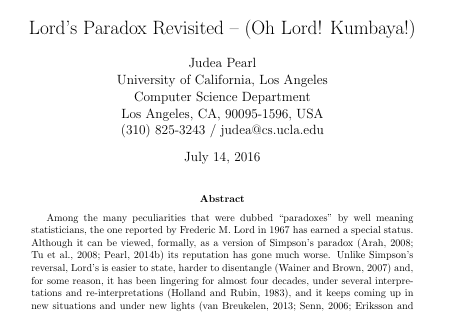

# Spoiler: It's not a paradox

```{r Setup, echo=FALSE, include=FALSE}
knitr::opts_chunk$set(echo = FALSE, include = FALSE, message = FALSE, 
					  warning = FALSE)
library(tidyverse)
library(emmeans)
library(car)
library(patchwork)
theme_set(theme_bw())
cols = c('dodgerblue2','goldenrod3')
a_mean = 150
b_mean = 160
set.seed(4)
a_0 = rnorm(500, a_mean, 5)
b_0 = rnorm(500, b_mean, 5)
delt = 0.2
set.seed(5)
a_1 = delt*a_mean + (1-delt)*a_0 + rnorm(500, 0, 2)
b_1 = delt*b_mean + (1-delt)*b_0 + rnorm(500, 0, 2)

l_df = data.frame(Sex = rep(c('M','F'), each = 500),
				Initial = c(b_0,a_0),
				Final = c(b_1,a_1),
				Gain = c(b_1,a_1) - c(b_0,a_0))
head(l_df)

l_df_long = (l_df
		   %>% select(-Gain)
		   %>% gather(Timepoint, Weight, Initial, Final))
head(l_df_long)
```

## Reference

Adapted and simplified from Judea Pearl's more technical and complete [2016
resolution](https://ftp.cs.ucla.edu/pub/stat_ser/r436.pdf) of the paradox.



# Lord's Formulation

## Lord's Formulation

"A large university is interested in investigating the effects on the students of 
the diet provided in the university dining halls and any sex differences in 
these effects. Various types of data are gathered. In particular, the weight of 
each student at the time of his arrival in September and his weight the 
following June are recorded."" (Lord 1967, p. 304)

- How do students' weights differ between the beginning and end of the year?
- How does sex affect the change in weight?

## Lord's Formulation

Lord posits two hypothetical statisticians who analyze the data

1. Performs an anova on the initial vs. final weights in each sex
	- Finds no difference
	
2. Performs an ancova on weight gain vs. sex controlling for initial weight
	- Finds a change in weight over time
	- Finds a strong effect of sex
	
Who is right? How do you decide?

## Lord's Forumulation

```{r, include = TRUE}
plt = ggplot(l_df, aes(Initial, Final)) +
	geom_point(aes(colour = Sex), alpha = 0.3) +
	stat_ellipse(aes(colour = Sex)) +
	geom_smooth(aes(colour = Sex), method = 'lm',
				se = FALSE) +
	# geom_smooth(method = 'lm', se = FALSE, colour = 'black') +
	geom_abline(intercept = 0, slope = 1, linetype = 2) +
	scale_colour_manual(values = cols)
plt
```

# A Digression: Mediating Variables

## Mediation


E.g. does poverty (X) cause cancer (Y)?

## Mediation


Maybe poverty (X) increases your exposure to environmental toxins (M), and it's
that exposure that causes cancer (Y). I.e. Environmental toxins _mediate_ the 
effect of poverty on cancer risk.

## Mediation


And maybe there are other ways in which poverty affects cancer risk that have 
nothing to do with environmental toxins.

## Mediation

We can think of the effect of X on Y in two ways:


- **Total effect:**
	- $TE = b + ac - a$
	
## Mediation

We can think of the effect of X on Y in two ways:


- **Total effect:**
	- $TE = b + ac - a$
- **Direct effect:**
	- $DE = b$

## Construct a mediated dataset


## Construct a mediated dataset {.smaller}


**NOT** Lord's data

```{r Mediation1, include=TRUE, echo=TRUE}
# Start with 1000 students
f_0 = rnorm(500, 150, 5)
m_0 = rnorm(500, 160, 5)
```

- $a$: initial weight is higher in males than in females

## Construct a mediated dataset {.smaller}


```{r Mediation2, include=TRUE, echo=TRUE}
# Start with 1000 students
f_0 = rnorm(500, 150, 5)
m_0 = rnorm(500, 160, 5)

g_fun = function(w_0){
	0.2 * w_0 + rnorm(length(w_0))
}
```

- $a$: initial weight is higher in males than in females
- $c$: weight gain is a linear function of initial weight

## Construct a mediated dataset {.smaller}


```{r Mediation3, include=TRUE, echo=TRUE}
# Start with 1000 students
m_df = (data.frame(Sex = rep(c('F','M'), each = 500),
				Initial = c(f_0, m_0))
		%>% mutate(Gain = g_fun(Initial),
				   Final = Initial + Gain))
```

- $a$: initial weight is higher in males than in females
- $c$: weight gain is a linear function of initial weight
- $b$: zero. There is no direct effect of sex on weight gain

## Mediated Dataset

```{r, include = TRUE}
ggplot(m_df, aes(Initial, Final)) +
	geom_point(aes(colour = Sex), alpha = 0.3) +
	stat_ellipse(aes(colour = Sex)) +
	# geom_smooth(aes(colour = Sex), method = 'lm',
	# 			se = FALSE) +
	geom_abline(intercept = 0, slope = 1, linetype = 2) +
	scale_colour_manual(values = cols)
```

# Bring in Lord's Statisticians

## Statistician 1 

Statistician 1 does not control for initial weight:

$$
G \sim \beta_0 + \beta_1 * S
$$

The $S$ variable here incorporates the **total effect** of sex on 
weight gain


$TE = b + ac - a$

## Statistician 1 {.smaller}

Intercept and sex are significant in this model

```{r LM1med, echo = TRUE, include = TRUE}
m_mod1 = lm(Gain ~ Sex, data = m_df)
summary(m_mod1)
```

```{r}
m_em_df = data.frame(emmeans(m_mod1, 'Sex'))
```

## Statistician 1 {.smaller}

Intercept and sex are significant in this model

```{r Boxplotmed, include = TRUE}
ggplot(m_df, aes(Sex, Gain)) +
	geom_jitter(aes(colour = Sex),
				alpha = 0.3, 
				width = 0.3) +
	geom_boxplot(fill = NA) +
	geom_point(data = m_em_df, aes(y = emmean),
			   size = 3, alpha = 0.5) +
	scale_colour_manual(values = cols)
```

## Statistician 1 {.smaller}


- Statistician 1 is looking at the **total effect** of sex: 
$TE = b + ac - a$
- $b$ was zero, but $a$ and $c$ were not

## Statistician 2

Controls for initial weight in their model

$$
G \sim \beta_0 + (\beta_1 * S) + (\beta_2 * W_I)
$$

The sex variable here only includes the **direct effect** of sex: $b$


## Statistician 2 {.smaller}

Intercept and sex are now null. The only variable that affects the 
outcome is initial weight

```{r LM2med, include = TRUE, echo=TRUE}
m_mod2 = lm(Gain ~ Sex + Initial, data = m_df)
summary(m_mod2)
```

## Statistician 2

```{r LordPltmed, include = TRUE}
ggplot(m_df, aes(Initial, Final)) +
	geom_point(aes(colour = Sex), alpha = 0.3) +
	stat_ellipse(aes(colour = Sex), alpha = 0.5) +
	geom_smooth(aes(colour = Sex), method = 'lm',
				se = FALSE) +
	geom_abline(intercept = 0, slope = 1, linetype = 2) +
	scale_colour_manual(values = cols)
```

## Statistician 2 {.smaller}


- Statistician 2 was looking for the **direct effect** of sex: $DE = b$
- They correctly found it to be 0

## Everyone is right - Context is everything

Who is "correct?"

- What can you influence?
- What story are you trying to tell?
- What is your goal?

# Back to Lord's Paradox

## Lord's Paradox | Data {.smaller}

```{r Scatter, include = TRUE}
plt = ggplot(l_df, aes(Initial, Final)) +
	geom_point(aes(colour = Sex), alpha = 0.3) +
	stat_ellipse(aes(colour = Sex)) +
	geom_smooth(aes(colour = Sex), method = 'lm',
				se = FALSE) +
	# geom_smooth(method = 'lm', se = FALSE, colour = 'black') +
	geom_abline(intercept = 0, slope = 1, linetype = 2) +
	scale_colour_manual(values = cols)
plt
```

## Lord's Paradox {.smaller}


- Statistician 1 (no $W_I$) tests the 
**total effect** of sex on gain ($b + ac - a$) and finds 
**no effect**
- Statistician 2 (includes $W_I$)
tests the **direct effect** of sex on gain ($b$) and finds 
**a significant effect**

How does this happen?

## Tricksiest. Dataset. Ever. {.smaller}


- Statistician 1 (no $W_I$) tests the 
**total effect** of sex on gain ($b + ac - a$) and finds 
**no effect**
- Statistician 2 (includes $W_I$)
tests the **direct effect** of sex on gain ($b$) and finds 
**a significant effect**

How does this happen? Easy!

- choose $b \ne 0$
- choose $a$ and $c$ s.t. $b = -(ac - a)$:
	- $b + ac - a = 0$

## Antimediation {.smaller}

- Males' initial weight is higher than females' ($+a$)
- Males' weight change intercept is higher than females' ($+b$)
- Initial weight is _negatively_ associated with gain ($-c$)

```{r, include = TRUE}
plt
```

## Antimediation {.smaller}

Choose the values correctly, and it all cancels.

```{r, include = TRUE}
l_mod1 = lm(Gain ~ Sex, data = l_df)
l_em_df = data.frame(emmeans(l_mod1, 'Sex'))
l_box = ggplot(l_df, aes(Sex, Gain)) +
	geom_jitter(aes(colour = Sex),
				alpha = 0.3, 
				width = 0.3) +
	geom_boxplot(fill = NA) +
	geom_point(data = l_em_df, aes(y = emmean),
			   size = 3, alpha = 0.5) +
	geom_linerange(data = l_em_df, inherit.aes = FALSE,
				   aes(x = Sex, ymin = lower.CL, ymax = upper.CL),
				   size = 3, alpha = 0.5) +
	scale_colour_manual(values = cols)
plt + l_box + plot_layout(guides = 'collect')
```


## Antimediation

Lord plotted **final weight** vs. initial weight

```{r, include=TRUE}
plt + l_box + plot_layout(guides = 'collect')
```

## Antimediation

Look at **gain** vs. initial weight.

```{r, include = TRUE}
g_i = ggplot(l_df, aes(Initial, Gain)) +
	geom_point(aes(colour = Sex), alpha = 0.3) +
	stat_ellipse(aes(colour = Sex)) +
	geom_smooth(aes(colour = Sex), method = 'lm',
				se = FALSE) +
	# geom_smooth(method = 'lm', se = FALSE, colour = 'black') +
	scale_colour_manual(values = cols) 
g_i + l_box + plot_layout(guides = 'collect')
```

# Should I control for baseline values?

## Antimediation

Lord's paradox has nothing to do with baseline values

- Any pair of variable can do this
	- as long as $a$ and $c$ have different signs


- E.g. cardiovascular disease vs. sex & body fat

# What Do

## What do we do about this?

Same thing we do every night, Pinky

- Know your system
- Know your question
- Make your decision
- Report what you did

# Fin
# Extra Slides
## Analysis

Two stastisticians analyze these data. It was 1967, so the available tools were:

- ANOVA
- ANCOVA

## Statistician 1

The first statistician compares the mean and variance of the initial vs. final 
weights in each of the two sexes:
	
- In females, the initial weights have the same mean and variance as the 
final weights
- Similarly in males, the initial and final weights have the same 
distribution

Any individual gains or losses cancel each other out, and overall there is 
negligible change in student weight in either group.

## Statistician 1 | ANOVA {.smaller}

```{r ANOVA, echo = TRUE, include = TRUE}
l_a_anov = aov(Weight ~ Timepoint, filter(l_df_long, Sex == 'F'))
Anova(l_a_anov)
l_b_anov = aov(Weight ~ Timepoint, filter(l_df_long, Sex == 'M'))
Anova(l_b_anov)
```

## Statistician 1 | ANOVA

```{r ANOVPlt, include = TRUE}
l_anov = ggplot(l_df_long, aes(Weight)) +
	geom_histogram() +
	facet_grid(Timepoint ~ Sex)
l_anov
```

## Statistician 1 | LM 1 {.smaller}

We can do an equivalent thing with a linear model:

```{r LM1, echo = TRUE, include = TRUE}
summary(l_mod1)
```
```{r}
```

## Statistician 1 | LM 1

```{r Boxplot, include = TRUE}
l_box
```

## Statistician 2 | ANCOVA {.smaller}

The second statistician decides to control for the initial weight of the 
students.

-  The slopes of the regression lines between initial and final weights are
similar in the two dorms, which allows them to compare the intercepts with
an ANCOVA:

```{r ANCOVA, echo = TRUE, include = TRUE}
l_ancov = aov(Gain ~ Sex + Initial, data = l_df)
Anova(l_ancov)
```

## Statistician 2 | LM2 {.smaller}

```{r LM2, include = TRUE, echo=TRUE}
l_mod2 = lm(Gain ~ Sex + Initial, data = l_df)
summary(l_mod2)
```

## Statistician 2 {.smaller}

```{r LordPlt, include = TRUE}
l_reg = ggplot(l_df, aes(Initial, Final)) +
	geom_point(aes(colour = Sex), alpha = 0.3) +
	stat_ellipse(aes(colour = Sex)) +
	geom_smooth(aes(colour = Sex), method = 'lm',
				se = FALSE) +
	geom_abline(intercept = 0, slope = 1, linetype = 2) +
	scale_colour_manual(values = cols) +
	ylab("Final Weight") +
	xlab("Initial Weight")
l_reg
```

The overall means and distributions may not have changed in either sex, but
for any given starting weight, male students gained more than female students.

## What Even

Who is right? How do we decide?